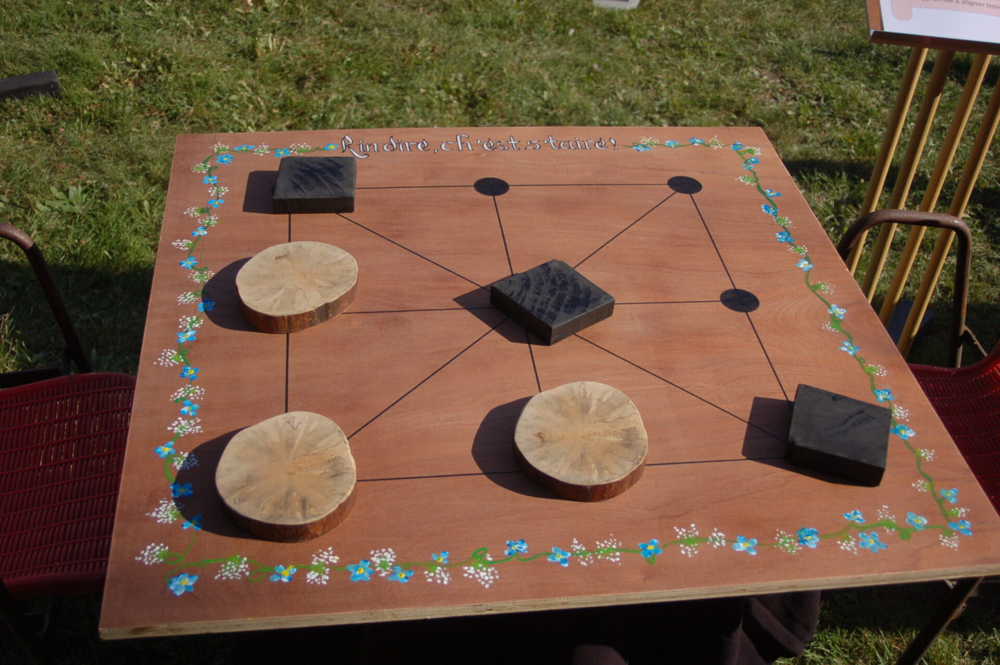

# Jeu des 3 Pions (Tic-Tac-Toe variante sénégalaise) 

## Description
<video width="620" height="540" controls>
  <source src="Assets/Découvrez le jeu des 3 pions_3.mp4" type="video/mp4">
  Votre navigateur ne supporte pas les vidéos HTML5.
</video>

Le jeu des <u>__* 3 pions *__</u> est une variante du classique Tic-Tac-Toe, où deux joueurs s'affrontent pour aligner trois de leurs pions sur une grille de 3x3. Ce projet implémente une version web simple du jeu en utilisant HTML, CSS et JavaScript.

## Technologies utilisées

### HTML
HTML est utilisé pour structurer le contenu du jeu et créer la grille.

### CSS
CSS est utilisé pour styliser le jeu, en rendant la grille et les pions visuellement attrayants.

### JavaScript
JavaScript est utilisé pour gérer la logique du jeu, permettre les interactions des joueurs et déterminer les conditions de victoire.

## Règles du jeu

### Matériel
- Une grille de 3x3.
- Chaque joueur dispose de trois pions, utilisant une couleur ou un motif différent de ceux de l'adversaire.

### Objectif
Le premier joueur qui aligne ses trois pions horizontalement, verticalement ou en diagonale gagne la partie.

### Déroulement du jeu
1. Les joueurs jouent à tour de rôle pour placer leur pion sur une case vide de la grille.
2. Un joueur ne peut pas placer son pion sur une case déjà occupée.

### Fin du jeu
- Le jeu se termine lorsque l'un des joueurs aligne trois de ses pions, ce qui le déclare vainqueur.
- Si les deux joueurs ont épuisé leurs pions sans qu'un vainqueur ne soit désigné, le jeu passe à une phase de déplacement.
- Dans la phase de déplacement, les joueurs peuvent déplacer leurs pions déjà présents sur la grille, mais un pion ne peut être déplacé que sur les cases vides adjacentes.
- La phase de déplacement se poursuit jusqu'à ce que les joueurs conviennent d'un match nul, car le maximum de cases à utiliser est de 6 sur 9.

### Stratégies
Les joueurs doivent élaborer des stratégies pour bloquer les tentatives de l'adversaire d'aligner trois pions, tout en maximisant les déplacements de leurs pions une fois qu'ils sont tous en jeu.

## Installation
Pour exécuter le jeu localement, suis ces étapes :

1. Clone le repository sur ta machine :
   ```bash
   git clone <URL_DU_REPOSITORY>
2. Accède au dossier du projet :
   ```bash
    cd nom-du-dossier
3. Ouvre le fichier index.html dans ton navigateur web.

## Auteurs
<u>__*Ibrahima Camara*__</u> (Ibrahima47) alias <u>__*47_Dev*__</u>
## Licence
Ce projet est sous licence MIT.
